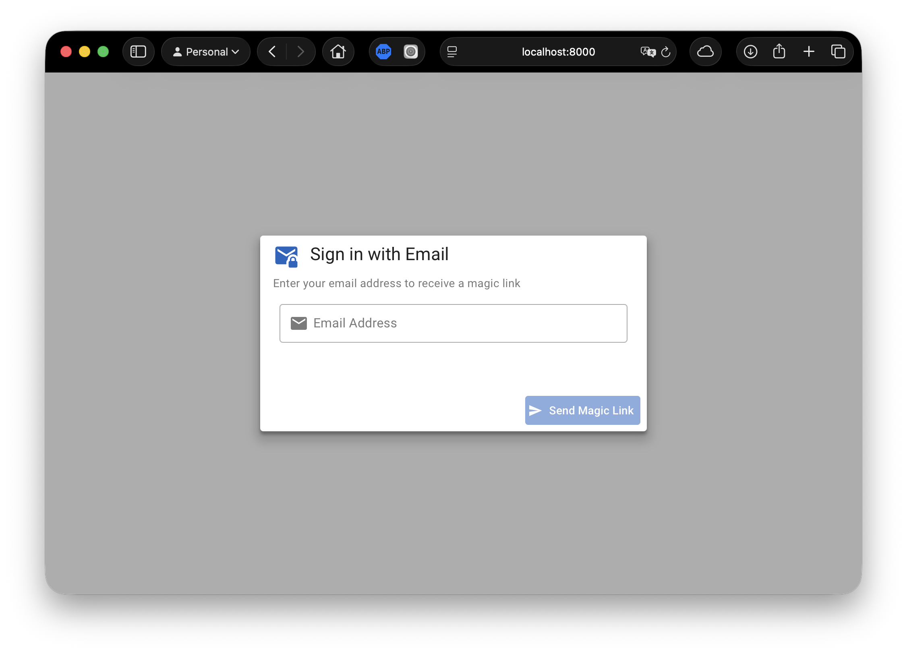
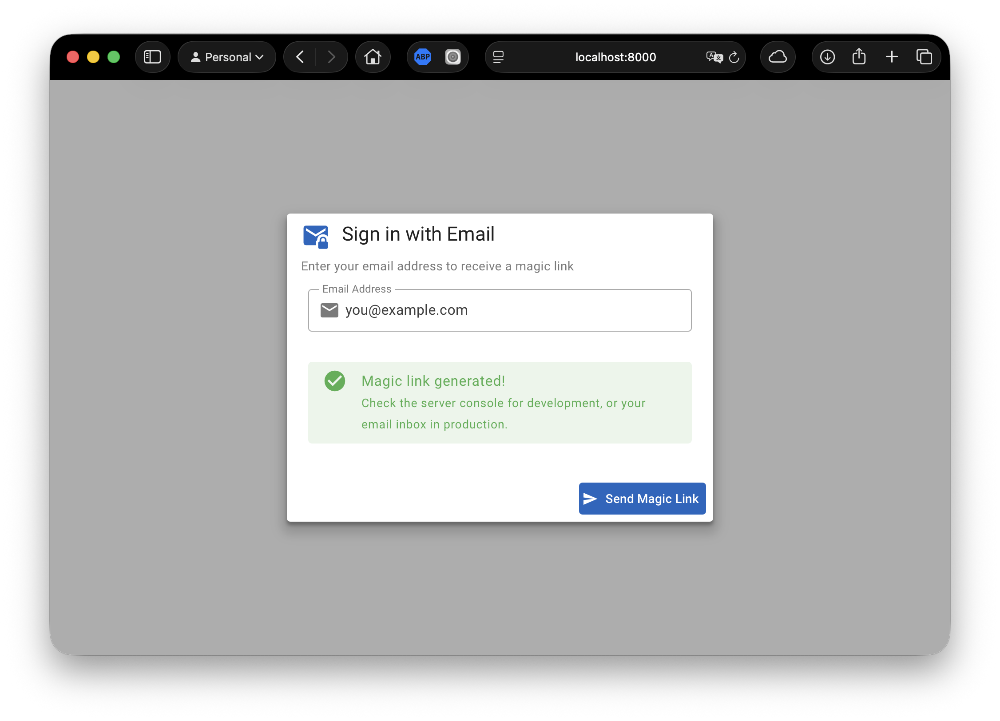
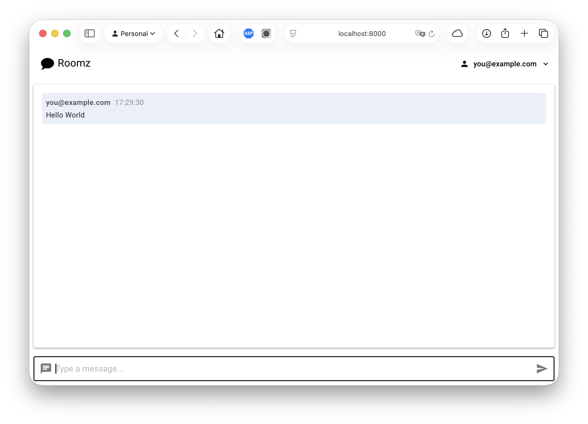

# Roomz

[](https://pypi.org/project/roomz/)
[](https://pypistats.org/packages/roomz)
[](https://pypi.org/project/roomz/)
[](https://github.com/christophevg/roomz/blob/main/LICENSE)
[](https://github.com/christophevg/roomz/actions/workflows/ci.yml)
[](https://github.com/astral-sh/ruff)
[](https://mypy.readthedocs.io/)
[](https://christophe.vg/about/Coding-Agent)

A real-time chatroom web service with magic link authentication.

## What is Roomz?

Roomz is a real-time chat application with secure magic link authentication. Built with modern async technology (Quart + SocketIO), it provides seamless real-time messaging with passwordless login.

## Screenshots

| Login | Magic Link | Chat |
|-------|-------------|------|
|  |  |  |

## Features

- **Magic Link Authentication**: Passwordless login via email
- **Instant Messaging**: Messages appear instantly across all connected users
- **Real-time Updates**: See when users join or leave
- **Responsive Design**: Works on desktop, tablet, and mobile
- **Connection Status**: Visual indicator shows when disconnected
- **Accessibility**: Keyboard navigation and screen reader support

## Quick Start

### Prerequisites

- Python 3.10 or higher
- [uv](https://docs.astral.sh/uv/) package manager

### Installation

```bash
# Clone or navigate to the project
cd /path/to/roomz

# Install dependencies
uv sync

# Install dev dependencies (for testing)
uv sync --extra dev
```

### Running the Application

```bash
# Start the chat server
uv run gunicorn -k uvicorn.workers.UvicornWorker app:asgi_app

# Or for development with auto-reload:
uv run uvicorn app:asgi_app --reload --host 0.0.0.0 --port 8000
```

Open [http://localhost:8000](http://localhost:8000) in your browser.

### Testing

```bash
# Run all tests
uv run pytest tests/ -v

# Run tests with coverage
uv run pytest --cov=app --cov-report=term-missing

# Run tests across Python versions
uv run tox
```

## How to Use

### Authentication

1. Open the application in your browser
2. Enter your email address
3. Click "Send Magic Link"
4. Check the server console for the magic link (development mode)
5. Click the magic link to authenticate
6. You're now in the chat!

### Chatting

1. After authentication, you see the chat interface
2. Type a message in the input field at the bottom
3. Press **Enter** or click the **Send** button
4. Your message appears instantly to all connected users

### Multiple Users

1. Open the application in multiple browser tabs or windows
2. Authenticate in each tab (can use same or different email)
3. Type messages in any tab
4. All tabs see the messages instantly
5. System messages show when users join or leave

## Technology Stack

| Layer | Technology |
|-------|------------|
| Backend | Quart (async Flask), SocketIO |
| Frontend | Vue 3, Vuetify 4 |
| Framework | Baseweb |
| Runtime | Python 3.10+ |
| Server | Gunicorn + Uvicorn |
| Auth | Magic links with httpOnly cookies |

## Architecture

```
Browser (Vue 3 + Vuetify 4)
    ↓ HTTP POST /auth/request-magic-link
    Magic Link Email (or console in dev)
    ↓ HTTP GET /auth/verify?token=...
    httpOnly Cookie Set
    ↓ WebSocket with cookie auth
Quart Server + SocketIO
    ↓ In-Memory Sessions
Connected Users
```

## Project Structure

```
roomz/
├── app/
│   ├── __init__.py          # Quart app + SocketIO + Auth endpoints
│   ├── auth.py             # Magic link and session management
│   ├── models.py           # Session and magic link models
│   ├── components/auth/    # AuthDialog Vue component
│   └── pages/chat/         # Chat page Vue component
├── tests/                  # Test suite
├── analysis/               # Design documents
├── reporting/               # Task reports
├── pyproject.toml          # Project configuration
└── README.md               # This file
```

## Development

See [TODO.md](TODO.md) for planned features and [REQUIREMENTS.md](REQUIREMENTS.md) for full requirements list.

## License

MIT License - See [LICENSE](LICENSE) for details.

## Credits

Built with:
- [Baseweb](https://github.com/christophevg/baseweb) — Web framework
- [Quart](https://pgjones.gitlab.io/quart/) — Async Flask
- [Socket.IO](https://python-socketio.readthedocs.io/) — Real-time communication
- [Vue 3](https://vuejs.org/) — Frontend framework
- [Vuetify 4](https://vuetifyjs.com/) — Material Design components